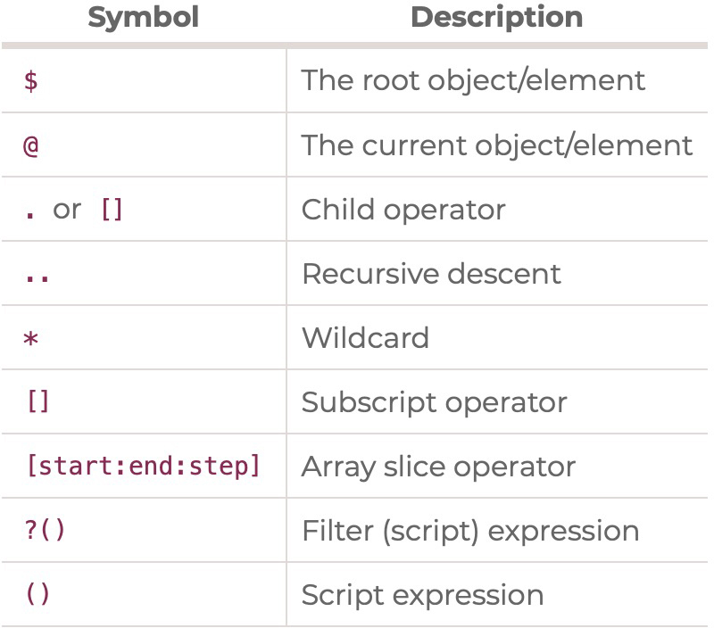

# Microservices with Node JS and React
- [Microservices with Node JS and React](#microservices-with-node-js-and-react)
  - [Adding a Submodule](#adding-a-submodule)
  - [Remote development over SSH](#remote-development-over-ssh)
  - [skaffold](#skaffold)
  - [Ingress NGINX Controller(minikube)](#ingress-nginx-controllerminikube)
  - [Managing Secrets using kubectl](#managing-secrets-using-kubectl)
    - [jsonpath](#jsonpath)
  
## Adding a Submodule

```sh

git submodule add https://github.com/<user>/microservices-ticketing-auth auth
# Newer versions of Git will do this automatically, but older versions will require you to explicitly tell Git to download the contents of submodule
git submodule update --init --recursive
# Clone command to ensure you download everything, including any submodules
git clone --recursive <project url>
# update the submodule to the latest remote commit.
git submodule update --remote --merge
# List Submodules in Git
git config --file .gitmodules --get-regexp path | awk '{ print $2 }'
# Set url 
git submodule set-url <path> <newurl>

# Delete submodule
git submodule deinit <submodule_directory>
git rm <submodule_directory>
rm -rf .git/modules/<submodule_directory>
git commit -m"Removed Submodule"
git push
```
## Remote development over SSH
Creating and connecting to a virtual machine (VM) via the Visual Studio Code Remote - [SSH extension](https://code.visualstudio.com/docs/remote/ssh-tutorial). 
```sh
# sudo systemctl restart sshd.service
# connect from windows to linux via ssh
# ssh -i C:\Users\Developer/.ssh/id_rsa <USER>@<IP>
```

## skaffold
[Skaffold](https://skaffold.dev/docs/quickstart/) handles the workflow for building, pushing and deploying your application, allowing you to focus on what matters most: writing code.
```sh
# For Linux x86_64 (amd64)
curl -Lo skaffold https://storage.googleapis.com/skaffold/releases/v2.0.0/skaffold-linux-amd64 && \
sudo install skaffold /usr/local/bin/

#minikube start
minikube start --profile custom
skaffold config set --global local-cluster true
eval $(minikube -p custom docker-env)

skaffold init --skip-build
skaffold dev
# skaffold run --tail

minikube ssh
curl -i <Cluster-IP>:<Port>
```

## Ingress NGINX Controller(minikube)
[ingress-nginx](https://kubernetes.github.io/ingress-nginx/deploy/#minikube) is an Ingress controller for Kubernetes using NGINX as a reverse proxy and load balancer.
```sh
minikube addons enable ingress

vi /etc/hosts
# 127.0.0.1 ticketing.dev

curl --location --request POST 'http://<Host>:3000/api/users/singup' \
--header 'Content-Type: application/json' \
--data-raw '{
    "email":"sdfsdfsdf@sdfsd.dfd",
    "password":"sdfsdfsdf"
}'
```

## Managing Secrets using kubectl
```sh 
echo -n '1f2d1e2e67df' > ./password.txt

# The default key name is the filename. You can optionally set the key name
kubectl create secret generic db-user-pass \
  --from-literal=username='admin' \
  --from-file=password=./password.txt

kubectl get secrets
kubectl describe secrets/db-user-pass

kubectl get secret db-user-pass -o jsonpath='{.data.password}' | base64 --decode
kubectl delete secret db-user-pass
  
```
### jsonpath
